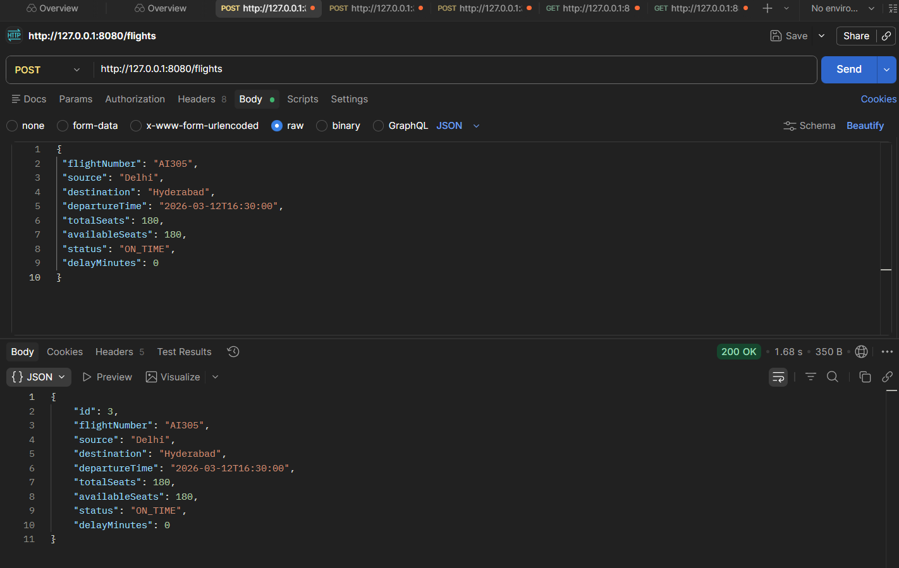
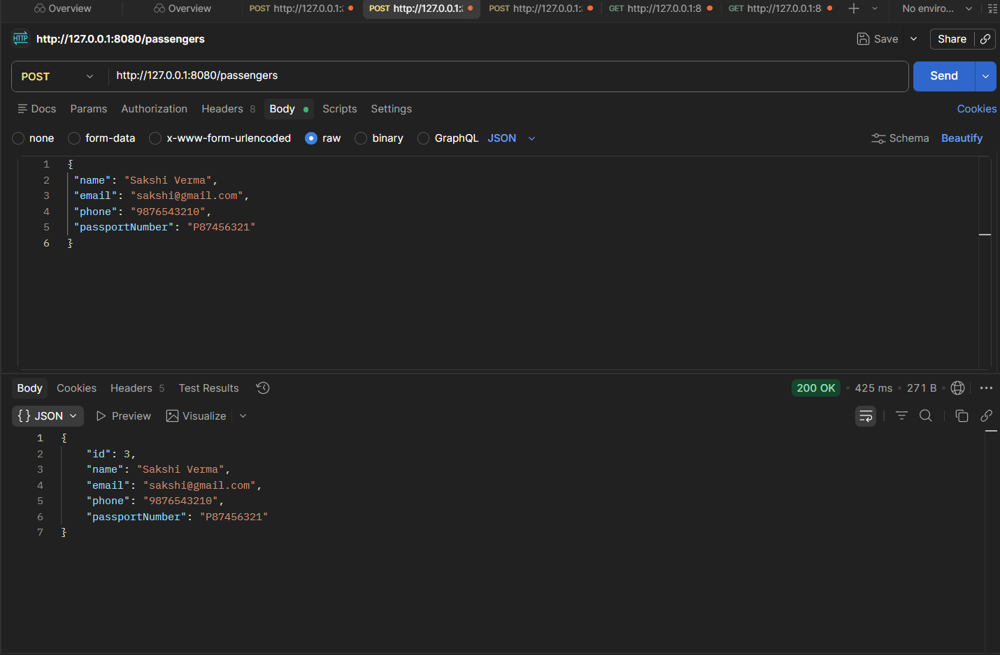
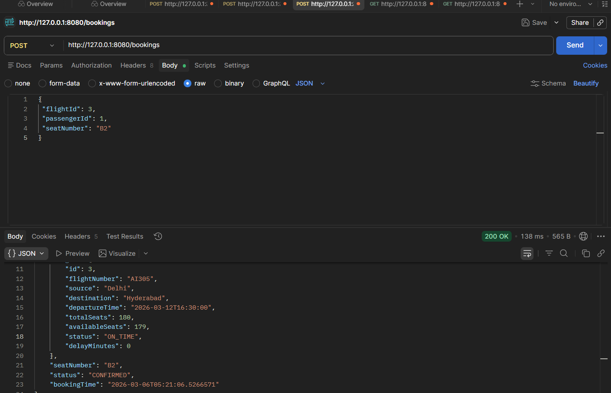
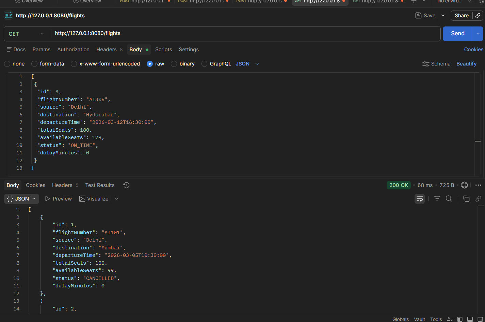
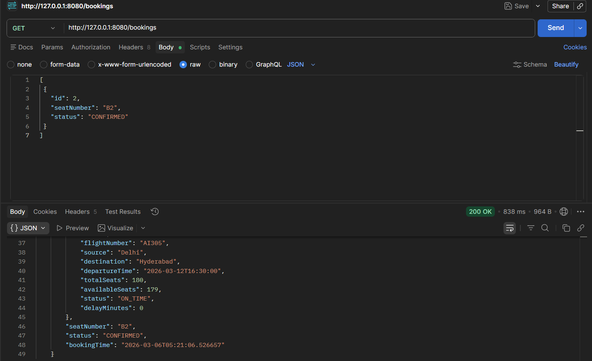
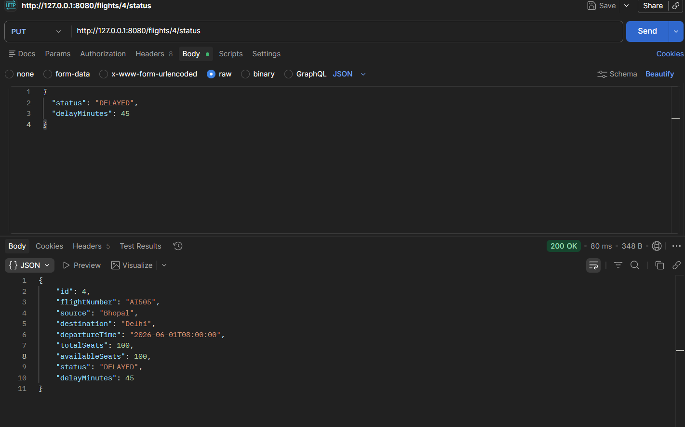

# ✈️ SkyTrack — Flight Delay Alert API

<div align="center">


**Event-driven Spring Boot API — flight delayed? Every booked passenger gets a real email automatically.**

[Live Frontend](https://flight-delay-frontend-seven.vercel.app) · [API Docs (Swagger)](https://flight-delay-alert-api.onrender.com/swagger-ui/index.html) · [Backend API](https://flight-delay-alert-api.onrender.com/flights)

</div>

---

## 🌐 Live

| Service | URL |
|---|---|
| Frontend Dashboard | https://flight-delay-frontend-seven.vercel.app |
| Backend API | https://flight-delay-alert-api.onrender.com/flights |
| Swagger UI (API Docs) | https://flight-delay-alert-api.onrender.com/swagger-ui/index.html |

---

## 📌 What Is This?

A Spring Boot REST API that automatically generates passenger alerts and sends real email notifications when a flight status changes to `DELAYED` or `CANCELLED` — no manual intervention required.

Secured with **JWT Authentication** — all write endpoints are protected. All APIs are documented with **Swagger UI** — testable directly in the browser.

---

## 🚀 What This Project Does

```
Admin updates flight status to DELAYED / CANCELLED
        ↓
System detects the change
        ↓
Alerts auto-generated for all booked passengers
        ↓
Real email sent to each passenger instantly
        ↓
Passengers check their alerts anytime via API
```

---

## 🛠️ Tech Stack

| Technology | Usage |
|---|---|
| Java 17 | Core language |
| Spring Boot 3.5 | Backend framework |
| Spring Security + JWT | Stateless authentication & authorization |
| Spring Data JPA + Hibernate | Database ORM |
| PostgreSQL (Neon Cloud) | Relational database |
| JavaMailSender | Real email notifications via Gmail SMTP |
| Springdoc OpenAPI (Swagger) | Interactive API documentation |
| Lombok | Boilerplate reduction |
| Docker | Containerization |
| Render | Cloud deployment |

---

## 📐 Architecture

```
Client (Browser / Postman)
        ↓
   JWT Filter              ← Token validated on every protected request
        ↓
   Controller Layer        ← HTTP only, no business logic
        ↓
   Service Layer           ← All business rules and decisions
        ↓
   Repository Layer        ← Database operations (Spring Data JPA)
        ↓
   PostgreSQL (Neon)       ← Persistent storage
```

---

## 🗄️ Database Schema

```
users
├── id, username (unique)
├── password (BCrypt hashed)
└── role (USER / ADMIN)

flights
├── id, flightNumber (unique), source, destination
├── departureTime, totalSeats, availableSeats
├── status (ON_TIME / DELAYED / BOARDING / CANCELLED / DEPARTED)
└── delayMinutes

passengers
├── id, name, email (unique)
├── phone, passportNumber (unique)

bookings
├── id, seatNumber, bookingTime (auto-set)
├── status (CONFIRMED / CANCELLED / COMPLETED)
├── flight_id (FK), passenger_id (FK)
└── UNIQUE constraint on (flight_id, seatNumber) ← prevents double booking

alert_notifications
├── id, message, triggerStatus
├── alertTime (auto-set), isRead
├── flight_id (FK), passenger_id (FK)
```

---

## 🔄 Flight Status — State Machine

```
ON_TIME  ──→ BOARDING
ON_TIME  ──→ DELAYED
ON_TIME  ──→ CANCELLED
DELAYED  ──→ BOARDING
DELAYED  ──→ CANCELLED
BOARDING ──→ DEPARTED
DEPARTED ──→ ❌ terminal
CANCELLED──→ ❌ terminal
```

Invalid transitions are rejected at the service layer — the system never enters an inconsistent state.

---

## 📡 API Endpoints

### Authentication (Public)
| Method | Endpoint | Description |
|---|---|---|
| POST | /auth/register | Register a new user |
| POST | /auth/login | Login — returns JWT token |

### Flights
| Method | Endpoint | Auth | Description |
|---|---|---|---|
| GET | /flights | Public | Get all flights |
| GET | /flights/{id}/status | Public | Get flight status |
| POST | /flights | 🔒 Token | Add a new flight |
| PUT | /flights/{id}/status | 🔒 Token | Update status — triggers alerts + email |

### Passengers
| Method | Endpoint | Auth | Description |
|---|---|---|---|
| GET | /passengers | 🔒 Token | Get all passengers |
| POST | /passengers | 🔒 Token | Register a passenger |

### Bookings
| Method | Endpoint | Auth | Description |
|---|---|---|---|
| POST | /bookings | 🔒 Token | Book a flight |
| PUT | /bookings/{id}/cancel | 🔒 Token | Cancel a booking |
| GET | /bookings/passenger/{id} | 🔒 Token | Get passenger bookings |

### Alerts
| Method | Endpoint | Auth | Description |
|---|---|---|---|
| GET | /alerts/{passengerId} | Public | Get passenger alerts |

> All protected endpoints require: `Authorization: Bearer <token>`

---

## 📬 Sample Requests

**Register & Login**
```bash
POST /auth/register
{ "username": "khushi", "password": "khushi123" }

POST /auth/login
{ "username": "khushi", "password": "khushi123" }
# Response: { "token": "eyJhbGci..." }
```

**Use token**
```
Authorization: Bearer eyJhbGci...
```

**Update Flight Status — triggers alerts + email automatically**
```json
PUT /flights/1/status
{
  "status": "DELAYED",
  "delayMinutes": 45
}
```

---

## ⚙️ How to Run Locally

**Prerequisites:** Java 17+, PostgreSQL or Neon DB, Maven

```bash
# 1. Clone
git clone https://github.com/sharmakhushi18/flight-delay-alert-api.git

# 2. Set environment variables in application.properties
SPRING_DATASOURCE_URL=your_postgresql_url
SPRING_DATASOURCE_USERNAME=your_db_username
SPRING_DATASOURCE_PASSWORD=your_db_password
SPRING_MAIL_USERNAME=your_gmail
SPRING_MAIL_PASSWORD=your_gmail_app_password
JWT_SECRET=your_secret_key_min_32_chars
JWT_EXPIRATION=86400000

# 3. Run
mvn spring-boot:run
```

Server: `http://localhost:8080`  
Swagger: `http://localhost:8080/swagger-ui/index.html`

---

## 💡 Key Design Decisions

**Why JWT?**
Stateless auth — no server-side session. Token carries identity and role. Scales horizontally without sticky sessions.

**Why pessimistic locking on seat booking?**
Two users booking the same seat simultaneously would both see it available and both succeed — causing double booking. Pessimistic lock ensures only one transaction proceeds at a time. DB unique constraint on `(flight_id, seatNumber)` is the final safety net.

**Why `@Transactional` on status update?**
Status change and alert generation must succeed or fail together. Partial state — status updated but alerts not generated — is never acceptable.

**Why state machine for FlightStatus?**
Prevents invalid transitions at compile time and runtime. A `DEPARTED` flight can never be moved back to `ON_TIME`. Enum makes the logic explicit and testable.

**Why try-catch around email?**
Email delivery is not guaranteed — SMTP can fail. Alert persistence to DB must succeed regardless. The alert record is the source of truth; email is a side effect.

**Why DB-level unique constraints?**
Application-level checks have race conditions. Two simultaneous requests can both pass the check before either commits. Only the database constraint guarantees correctness.

**Why BCrypt?**
Passwords are never stored in plain text. BCrypt is slow by design — making brute force attacks expensive.

---

## ✅ Features Completed

- [x] JWT Authentication + Spring Security
- [x] Event-driven email alerts on status change
- [x] Pessimistic locking — concurrent booking safety
- [x] DB unique constraint on `(flight_id, seatNumber)`
- [x] State machine — invalid transitions rejected
- [x] `@Transactional` — atomic status + alert creation
- [x] Swagger UI — interactive API documentation
- [x] Docker + Render deployment
- [x] Input validation with Bean Validation API

## 🔮 Planned

- [ ] WebSocket — real-time push alerts without polling
- [ ] Pagination — for large flight/passenger datasets
- [ ] Rate limiting — Redis-based request throttling

---

## 📸 Screenshots

**Create Flight**


**Create Passenger**


**Create Booking**


**Get Flights**


**Get Bookings**


**Update Flight Status**


---

## 👩‍💻 Author

**Khushi Sharma**
Java Backend Developer | Spring Boot · PostgreSQL · React
Final Year ECE · LNCT Bhopal

[](https://github.com/sharmakhushi18)
[](https://www.linkedin.com/in/khushissharma)
